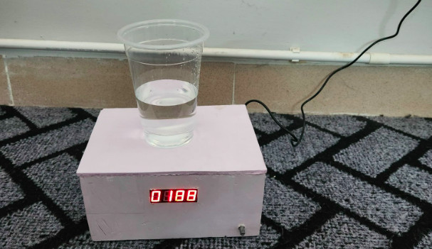

# Magnetic Stirrer

## Hardware required
- STM32f103c8t6
- H-bridge l298n
- LM2596
- Adapter 12V
- JGA25-370 DC Geared Motor (Any type)
- Potentiometer
- Grove - 4-Digit Display

## To do task
- [x] Build circuit diagrams
- [x] Reads the speed value from the potentiometer/push button, then outputs the corresponding pwm pulse
response to control the motor.
- [x] Read the motor speed feedback from the encoder/Hall sensor to display on the screen.
## Block diagram

## Connection

## References
- https://microbenotes.com/magnetic-stirrer-principle-parts-types-uses-examples/
- https://www.youtube.com/watch?v=fUARb2Z7k4g
- https://www.youtube.com/watch?v=YurNp_BpUWk
